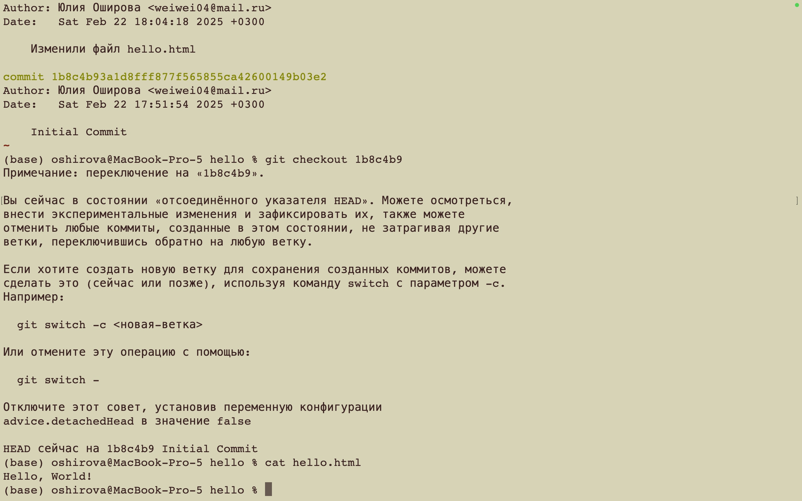

---
## Front matter
lang: ru-RU
title: Лабораторная работа №1
subtitle: Работа с Git
author:
  - Оширова Юлия Николаевна
institute:
  - Российский университет дружбы народов, Москва, Россия

## i18n babel
babel-lang: russian
babel-otherlangs: english

## Formatting pdf
toc: false
toc-title: Содержание
slide_level: 2
aspectratio: 169
section-titles: true
theme: metropolis
header-includes:
 - \metroset{progressbar=frametitle,sectionpage=progressbar,numbering=fraction}
---

# Информация

## Докладчик

  * Оширова Юлия Николаевна
  * студентка группы НФИбд-01-22
  * Российский университет дружбы народов

## Цель работы

Приобрести практические навыки работы с системой управления версиями Git.

## Задания

1. Создать репозиторий

2. Изменить его содержимое, изучить работу с коммитами, версиями и тегами

3. Поработать с объектами Git

4. Создать дополнительную ветку, провести слияние, разрешение конфликтов

5. Создать клон репозитория и слить его с оригинальным

6. Залить и извлечь изменения

# Выполнение лабораторной работы

## Подготовка

{#fig:001 width=70%}

## Создание проекта

{#fig:002 width=30%}

{#fig:002 width=30%}

## Внесение изменений

{#fig:004 width=50%}

## Внесение изменений

Изменим страницу «Hello, World», чтобы она содержала стандартные теги <html> и <body>.

```
<html>
  <body>
    <h1>Hello, World!</h1>
  </body>
</html>
```

## Внесение изменений

{#fig:005 width=70%}

## Внесение изменений

{#fig:006 width=70%}

## История

{#fig:007 width=50%}

## Получение старых версий

{#fig:008 width=70%}

## Создание тегов версий

{#fig:009 width=70%}

## Отмена локальных изменений (до индексации)

{#fig:011 width=50%}

## Отмена проиндексированных изменений (перед коммитом)

{#fig:012 width=40%}

## Отмена коммитов

{#fig:013 width=50%}

## Удаление коммиттов из ветки

{#fig:014 width=50%}

## Удаление коммиттов из ветки

{#fig:015 width=50%}

## Удаление тега oops

{#fig:016 width=50%}

## Изменение предыдущего коммита

{#fig:017 width=70%}

## Изменение предыдущего коммита

{#fig:018 width=50%}

## Перемещение файлов

Переместим наш файл в каталог lib. Для этого создадим его и используем команду git mv, сделаем коммит этого пермещения.

## Подробнее о структуре

{#fig:019 width=70%}

## Git внутри: Каталог .git

{#fig:020 width=40%}

## Работа непосредственно с объектами git

{#fig:019 width=40%}

## Создание ветки

{#fig:022 width=70%}

## Создание ветки

{#fig:023 width=70%}

## Навигация по веткам

{#fig:026 width=60%}

## Навигация по веткам

{#fig:027 width=70%}

## Изменения в ветке master

{#fig:029 width=40%}

## Слияние

{#fig:030 width=40%}

## Создание конфликта

{#fig:031 width=30%}

## Разрешение конфликтов

{#fig:032 width=70%}

## Разрешение конфликтов

{#fig:033 width=70%}

## Сброс ветки style

{#fig:034 width=30%}

## Сброс ветки style

{#fig:035 width=30%}

## Сброс ветки master

{#fig:036 width=30%}

## Сброс ветки master

{#fig:037 width=30%}

## Перебазирование

{#fig:038 width=30%}

## Слияние в ветку master

{#fig:039 width=30%}

## Клонирование репозиториев

{#fig:040 width=70%}

## Клонирование репозиториев

{#fig:041 width=70%}

## Что такое origin?

{#fig:042 width=70%}

## Удаленные ветки

Посмотрим на ветки, доступные в нашем клонированном репозитории. Можно увидеть, что в списке только ветка master.

## Изменение оригинального репозитория

{#fig:043 width=70%}

## Изменение оригинального репозитория

{#fig:044 width=50%}

## Слияние извлеченных изменений

{#fig:045 width=70%}

## Добавление ветки наблюдения

{#fig:046 width=60%}

## Создание чистого репозитория

{#fig:047 width=70%}

## Отправка и извлечение изменений 

{#fig:048 width=60%}

## Отправка и извлечение изменений 

{#fig:049 width=60%}

# Выводы

В процессе выполнения данной лабораторной работы я приобрела практические навыки работы с Git.